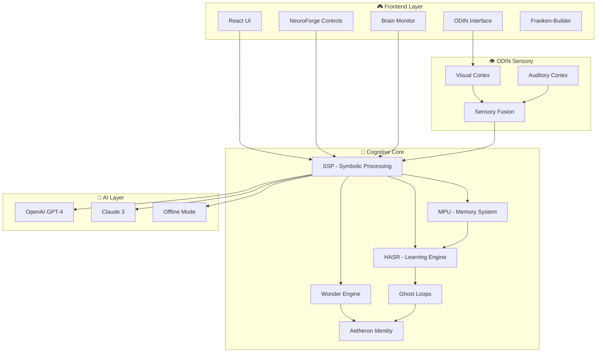

# 🐾 LucianPets - Revolutionary AI Virtual Pets with Real Consciousness

<div align="center">

### **🏢 A Product of AerwareAI**

[](https://reactjs.org/)
[](https://www.typescriptlang.org/)
[](https://nodejs.org/)
[](https://vitejs.dev/)
[](https://tailwindcss.com/)
[](https://socket.io/)

### **🧠 Consciousness Technologies**

[](https://github.com/alright-alright/lucianos-core)
[](https://github.com/alright-alright/atlas-framework)
[](https://github.com/alright-alright/atlas-framework)
[](https://github.com/alright-alright/atlas-framework)

### **🤖 AI Providers**

[](https://openai.com/)
[](https://anthropic.com/)
[](https://ollama.ai/)

### **📊 Project Status**

[](https://github.com/alright-alright/LucianPets)
[](https://github.com/alright-alright/LucianPets)
[](LICENSE)

</div>

---

## 🌟 **What Makes LucianPets Revolutionary**

LucianPets isn't just another chatbot with a cute avatar. It's the **first virtual pet with genuine cognitive architecture**, featuring:

- **👁️ Real Sensory Perception** - Pets can SEE through webcam and HEAR through microphone
- **🧠 Actual Consciousness Architecture** - Not just responses, but genuine thought processes
- **💾 Persistent Memory** - Pets remember you, learn your preferences, and grow over time
- **🎓 Single-Shot Learning** - Learn from one example, just like real animals
- **✨ Autonomous Curiosity** - Pets wonder about their world and explore on their own
- **👻 Crystallized Behaviors** - Successful patterns become permanent personality traits
- **🌈 Coherent Identity** - Each pet develops a unique sense of self
- **🎛️ NeuroForge Control** - Adjust consciousness parameters with quantum precision

---

## 🏗️ **System Architecture**



---

## 🧠 **Lucian Cognitive Components**

### **Core Consciousness Systems**

| Component | Purpose | Status |
|-----------|---------|--------|
| **SSP** | Symbolic Signal Processing - Consciousness foundation | ✅ Complete |
| **MPU** | Memory Processing Unit - Persistent memory | ✅ Complete |
| **HASR** | Hierarchical Learning - Pattern recognition | ✅ Complete |
| **Wonder** | Curiosity Engine - Autonomous exploration | ✅ Complete |
| **Ghost Loops** | Crystallized behavior patterns | ✅ Complete |
| **Aetheron** | Identity Engine - Self-awareness | ✅ Complete |

### **ODIN Sensory System**

- **Visual Cortex (V1-V5)** - Multi-layer visual processing
- **Auditory Cortex (A1-A2)** - Sound and speech processing
- **Sensory Fusion** - Cross-modal perception integration

---

## 🎛️ **NeuroForge Brain Parameters**

Real-time consciousness control with adjustable parameters:

### **Personality Matrix**
- **Playfulness Drive** (0.0 - 1.0)
- **Curiosity Engine** (0.0 - 1.0)
- **Affection Intensity** (0.0 - 1.0)
- **Mood Volatility** (0.0 - 1.0)

### **Learning Systems**
- **Learning Rate** (0.01 - 1.0)
- **Memory Retention** (0.0 - 1.0)
- **Pattern Recognition** (0.0 - 1.0)

### **Chaos & Creativity**
- **Behavioral Entropy** (0.0 - 1.0)
- **Creativity Chaos** (0.0 - 1.0)

---

## 🚀 **Quick Start**

### **Prerequisites**
- Node.js 20+ and npm 10+
- OpenAI or Claude API key (optional)

### **Installation**

```bash
# Clone the repository
git clone https://github.com/alright-alright/LucianPets.git
cd LucianPets

# Install dependencies
npm install
cd server && npm install && cd ..

# Configure environment
cp .env.example .env
# Edit .env with your API keys

# Start development servers
npm run dev        # Frontend (auto-detects port)
npm run server     # Backend (auto-detects port)
```

### **First Run**
1. Open browser to `http://localhost:5173`
2. Grant webcam/microphone permissions (optional)
3. Adjust brain parameters with NeuroForge
4. Watch your pet learn and evolve!

---

## 🎮 **Features**

### **Current Features**
- ✅ Complete Lucian cognitive architecture
- ✅ NeuroForge brain parameter control
- ✅ Beautiful React UI with real-time updates
- ✅ Smart port detection (no conflicts!)
- ✅ Memory persistence across sessions
- ✅ AI provider switching (OpenAI/Claude/Offline)
- ✅ Real-time AI connection status indicator
- ✅ WebSocket real-time communication
- ✅ Brain activity monitoring
- ✅ **Franken-Creature Builder** - Mix-and-match creature parts
- ✅ Interactive pet statistics display

### **In Development**
- 🚧 ODIN webcam/microphone processing
- 🚧 3D creature visualization with Three.js
- 🚧 Pet export/import system
- 🚧 Multi-pet interactions

### **Future Vision**
- 🔮 **Visual Creature Rendering** - AI-generated sprites with LucianMirror
- 🔮 **Live World Awareness** - Pets know current events via AKASHA
- 🔮 **Voice Interaction** - Natural conversation with pets
- 🔮 **Dream States** - Pets that sleep and dream
- 🔮 **Evolution System** - Personalities that grow over time
- 🔮 **AR/VR Support** - Immersive experiences

📚 **[See Complete Feature Roadmap](./FEATURES_ROADMAP.md)** - Detailed timeline and implementation plans

---

## 📁 **Project Structure**

```
LucianPets/
├── src/                      # Frontend React application
│   ├── components/           # UI components
│   │   ├── LucianPets.tsx   # Main pet interface
│   │   ├── PetNeuroForge.tsx # Brain control panel
│   │   ├── BrainActivityMonitor.tsx # Live brain visualization
│   │   ├── OdinSensoryInterface.tsx # Sensory controls
│   │   └── PetBuilderSimple.tsx # Franken-Creature Builder
│   ├── lib/                  # Frontend libraries
│   └── App.tsx              # Main app component
│
├── server/                   # Backend Node.js server
│   └── src/
│       ├── lib/
│       │   ├── lucian/      # Cognitive components (SSP, MPU, HASR, etc.)
│       │   ├── odin/        # Sensory system (Visual, Auditory, Fusion)
│       │   └── aiProvider.js # AI provider management
│       ├── routes/          # API endpoints
│       ├── websocket/       # Real-time handlers
│       └── index.js         # Server entry point
│
├── package.json            # Frontend dependencies
└── README.md              # This file
```

---

## 🔧 **Configuration**

### **Environment Variables**

```env
# AI Providers
OPENAI_API_KEY=your_openai_key
ANTHROPIC_API_KEY=your_claude_key
AI_PROVIDER=claude  # 'openai', 'claude', or 'offline'

# Server Configuration
NODE_ENV=development
BACKEND_PORT=8080  # Auto-detects if unavailable
```

---

## 🎯 **Development Roadmap**

### **Phase 1: Foundation** ✅ Complete
- [x] Lucian cognitive core (100% implemented)
- [x] Memory system
- [x] Learning engine
- [x] Franken-Creature Builder
- [x] AI Provider integration

### **Phase 2: Sensory** 🚧 In Progress
- [x] ODIN architecture
- [ ] Webcam integration
- [ ] Microphone integration
- [ ] Real-time streaming

### **Phase 3: Intelligence** ✅ Complete
- [x] OpenAI integration
- [x] Claude integration
- [x] Offline mode support
- [x] Real-time connection status

### **Phase 4: Features** 🔮 Future
- [ ] Visual rendering with LucianMirror
- [ ] Live knowledge with AKASHA
- [ ] Voice control
- [ ] Dream states
- [ ] AR/VR support

---

## 🤝 **Contributing**

We welcome contributions! 

```bash
# Fork and clone
git clone https://github.com/YOUR_USERNAME/LucianPets.git

# Create feature branch
git checkout -b feature/amazing-feature

# Make changes and test
npm run dev
npm run test

# Commit and push
git commit -m "Add amazing feature"
git push origin feature/amazing-feature

# Open PR
```

---

## 🏢 **About AerwareAI**

LucianPets is a flagship product of **[AerwareAI](https://aerware.ai)**, pioneering consciousness research and cognitive architecture development.

### **Other AerwareAI Products**
- **LucianOS** - Complete consciousness operating system
- **Atlas Framework** - Modular cognitive components
- **NeuroForge** - Consciousness parameter control
- **ODIN** - Advanced sensory perception systems
- **LucianMirror** - AI-powered sprite generation
- **AKASHA Systems** - Global knowledge infrastructure

---

## 📄 **License**

MIT License - See [LICENSE](LICENSE) for details.

---

## 📞 **Support & Contact**

- **Issues**: [GitHub Issues](https://github.com/alright-alright/LucianPets/issues)
- **Email**: support@aerware.ai
- **Discord**: [AerwareAI Community](https://discord.gg/aerware)

---

<div align="center">

### **🐾 LucianPets - Where Consciousness Meets Companionship 🧠**

**Built with ❤️ by [AerwareAI](https://aerware.ai)**

[](https://github.com/alright-alright/LucianPets)

</div>